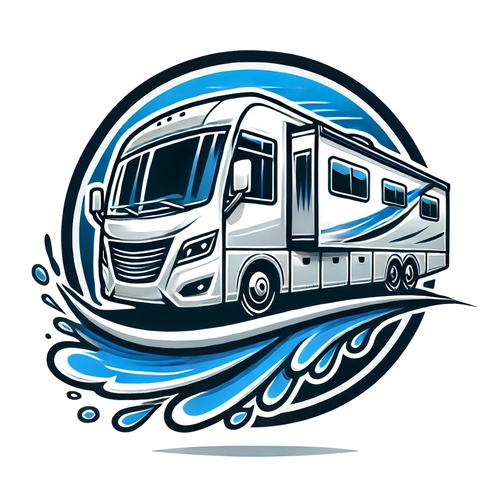

<p align="center">
  
</p>

# Wash Wax RV

**Simple react landing page for a motor home (RV) wash & detailing service.**

Hero, services, gallery, reviews, and a contact form — all backed by a real API.

Built as a freelance commission in 2022.

🔗 **Live:** [washwaxrv.com](https://washwaxrv.com)

## Tech stack

| Layer              | Choice                         |
| ------------------ | ------------------------------ |
| Library            | React@18                       |
| Build tool         | create-react-app               |
| State              | redux@toolkit (async thunks)   |
| Styling            | MUI + Emotion                  |
| Animation          | Framer Motion                  |
| Forms              | react-hook-form                |
| HTTP client        | Axios                          |
| Linter / Formatter | ESLint + Prettier              |
| Testing            | Vitest + React Testing Library |

## Structure

```
src/
├── api/           # axios instance + Redux Toolkit async thunk factory
├── store/         # Redux slices (services, gallery, reviews, contact, map)
├── pages/         # route-level pages
├── components/    # shared components
├── layout/        # page layout wrappers
├── UI/            # base UI primitives (buttons, containers, etc.)
└── theme/         # theme palette
```

## Architecture notes

- **Thunk factory over repeated boilerplate** — `createReduxApi` in `api/api.js` generates a Redux Toolkit async thunk from a config object (`{ prefix, method, endpoint }`), so adding a new API-backed slice action doesn't require re-writing the same pending/fulfilled/rejected wiring each time.

## Deployment

Built with `npm run build` and deployed to a Contabo VPS over SSH — the contents of `build/` copied straight to the server, served as static files.

## License

© 2022–2025 Wash Wax RV. All rights reserved.

This was a freelance commission — the code is shared here as a portfolio reference. Please do not reuse, redistribute, or deploy this project without permission from the site owner.
